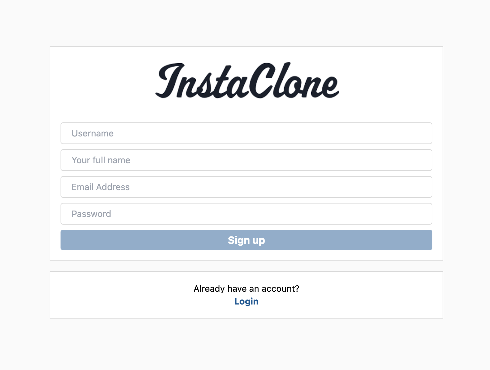
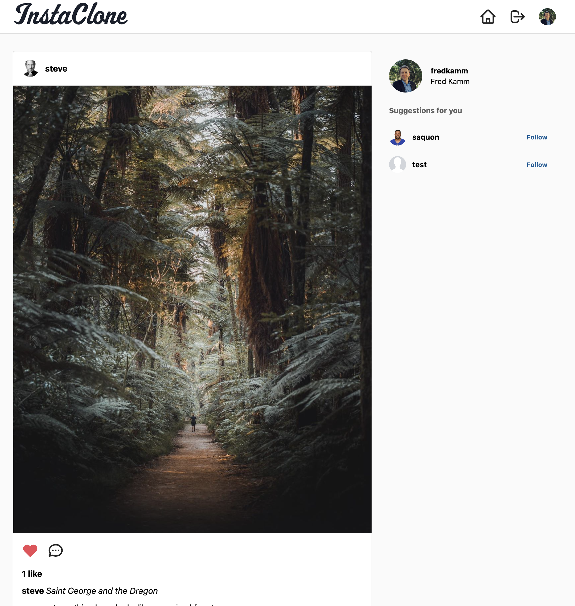
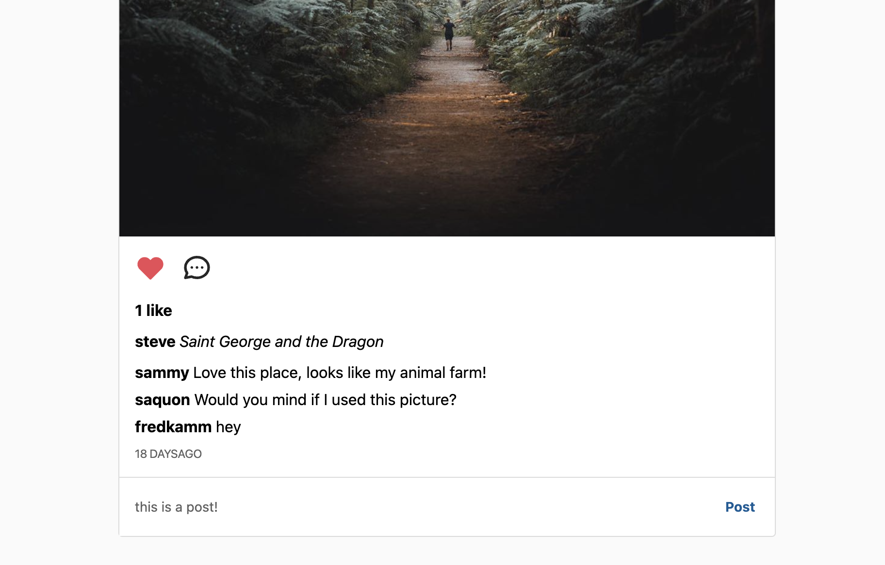
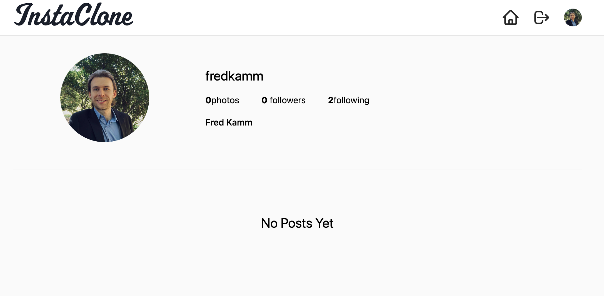

# Instaclone

This is Instaclone.
This app was built using React, Firebase & Tailwind CSS. I have built the following pages within this application: login, sign up, dashboard & lastly the user profile page. There are four different pages, some are public and some are private with auth listeners. Firebase firestore handles all the data, and that data is retrieved using a custom hook.

# Inspiration

# Usage

    

        The best way to use this app is through a web browser. It is still a work in progress with getting the app to be fully mobile responsive on any device
    

    <a href="https://fredkammweatherapp.netlify.app/">
        Click here to visit my app!
    </a>

 

    
    
    
    
    

    
Notice that the background color is different in the two screenshots   This happens based off temperatures. Currently, when the temperature is ABOVE 60° the background color will be orange. When temperature is BELOW 60° the background changes to blue

# Tools Used

- 
- 
-  -- for the icons
- 
-  -- used for the current date and time
- 

# Questions

    
Any questions or would like to collaborate Please shoot me an <a href="mailto:fred.kamm95@gmail.com"> Email </a>

    
If you would like to view more of my work  Visit my <a href="https://github.com/fredkamm ">Github</a> profile

